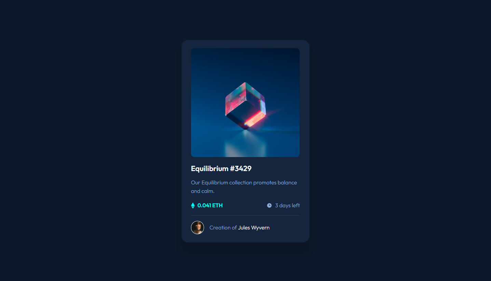
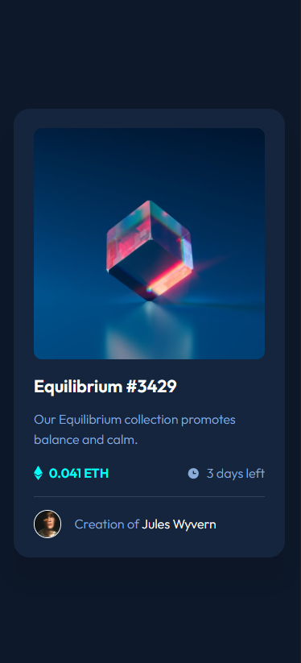

# Frontend Mentor - NFT preview card component solution

This is a solution to the [NFT preview card component challenge on Frontend Mentor](https://www.frontendmentor.io/challenges/nft-preview-card-component-SbdUL_w0U). Frontend Mentor challenges help you improve your coding skills by building realistic projects. 

## Table of contents

- [Overview](#overview)
  - [The challenge](#the-challenge)
  - [Screenshot](#screenshot)
  - [Links](#links)
- [My process](#my-process)
  - [Built with](#built-with)
  - [What I learned](#what-i-learned)
  - [Continued development](#continued-development)
  - [Useful resources](#useful-resources)
- [Author](#author)

## Overview

### The challenge

Users should be able to:

- View the optimal layout depending on their device's screen size
- See hover states for interactive elements

### Screenshot

### Links

- Solution URL: [Solution URL here](https://github.com/Laura-BugFree/nft-preview-card-component.git)
- Live Site URL: [Live site URL here](https://laura-bugfree.github.io/nft-preview-card-component/)

## My process

### Built with

- CSS custom properties
- Flexbox
- Mobile-first workflow

### What I learned

- I have just begun to use CSS custom properties
- The biggest thing was the hover effect on the image.

### Continued development

I would like to use CSS custom properties more. And conitue to expand my CSS understanding.

### Useful resources

- [Hover effects with images](https://www.w3schools.com/howto/howto_css_image_overlay_icon.asp) 

## Author

- Website - [Laura - Bugzfree]()
- Frontend Mentor - [@Laura-Bugfree](https://www.frontendmentor.io/profile/Laura-Bugfree)

